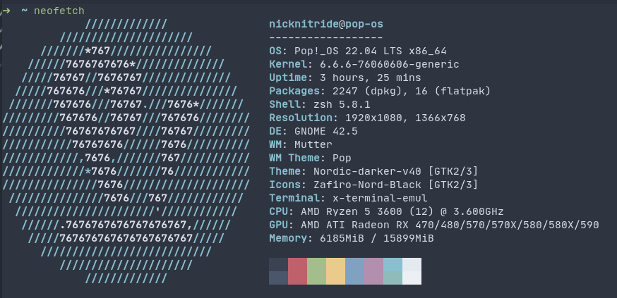
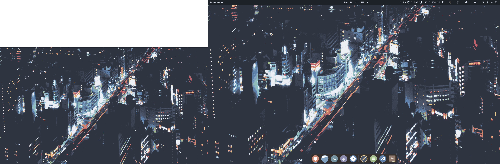

# My Personal Pop-OS Setup 
These setup steps are for my own convenience and pertain to **Pop_!OS 20.04 LTS** AKA Pre-Cosmic DE. This repo will be deleted/modified after Cosmic Releases. 

### Neofetch:

### Config Files Included:
- `.zshrc` (Oh-My-Zsh with auto-syntax-highlighting, lsd, and autcomplete)
- alacritty YAML config file (Nord-Themed)
- Themes to be imported into `usr/share/(icons|themes)`
    - Shell, Icons, and Cursor Themes
### Final Result:

---
## Desktop-Specific (Broadcom Fenvi T919 WIFI Card):
```
sudo apt install bcmwl-kernel-source
```
- Purpose: Drivers that enable WIFI
### CoreCtrl (AMD GPU Control)
View install instructions here: https://gitlab.com/corectrl/corectrl
___
## Essential Packages
```
sudo apt update && sudo apt upgrade -y
sudo apt install vlc code gnome-tweaks transmission ddcutil zsh telegram-desktop alacritty neofetch gnome-sushi gnome-screenshot

#optional:
sudo apt install lutris
```
- ddcutil is for the monitor brightness gnome plugin
___


## Misc. Install Scripts
Signal

`sudo sh ./Signal_Install.sh`

Spotify:

`sudo sh ./Spotify_Install.sh`

Flatpak Apps:

`flatpak install bitwarden obsidian io.github.realmazharhussain.GdmSettings`
- GDM-Settings (Set GDM3/Greeter Background)

Deb Files:

lsd:
https://github.com/lsd-rs/lsd
- install: `sudo dpkg -i ./lsd-musl_1.0.0_amd64.deb`
___
## Font Install/Copy
`sudo cp -r ./jetbrains /usr/share/fonts/truetype/`

## Config Files:
### Alacritty: 
`cp ./alacritty/alacritty.yml ~/.config/alacritty/`
### Oh-My-Zsh/ZSH Install:
```
# Install Oh-My-Zsh:
sh -c "$(curl -fsSL https://raw.githubusercontent.com/ohmyzsh/ohmyzsh/master/tools/install.sh)"

# Install OMZ Extensions
git clone https://github.com/zsh-users/zsh-syntax-highlighting.git ${ZSH_CUSTOM:-~/.oh-my-zsh/custom}/plugins/zsh-syntax-highlighting
git clone https://github.com/zsh-users/zsh-autosuggestions ${ZSH_CUSTOM:-~/.oh-my-zsh/custom}/plugins/zsh-autosuggestions


# Copy zsh config file
cp ./OMZ/.zshrc ~/.zshrc

# Copy LSD_Alias:
cp ./OMZ/lsd_alias.zsh ~/.oh-my-zsh/custom/
# Change Shell to zsh
sudo chsh -s $(which zsh)
source .zshrc
```

### Note to Self:
- Transfer SSH keys over manually
### Gnome-Extensions:
Gnome Extensions:
1. User Themes
2. Emoji Selector
3. Resource Monitor
4. Adjust Display Brightness

### Links:
1. Nordic-Darker Theme:
https://www.gnome-look.org/p/1267246/
2. Zafiro Icons: https://www.pling.com/p/1937741/
3. S1mple Cursor Pack: https://www.gnome-look.org/p/1932768
4. Nordic-Dark Firefox Theme: https://github.com/EliverLara/firefox-nordic-theme
- (4 isn't included in the install section)